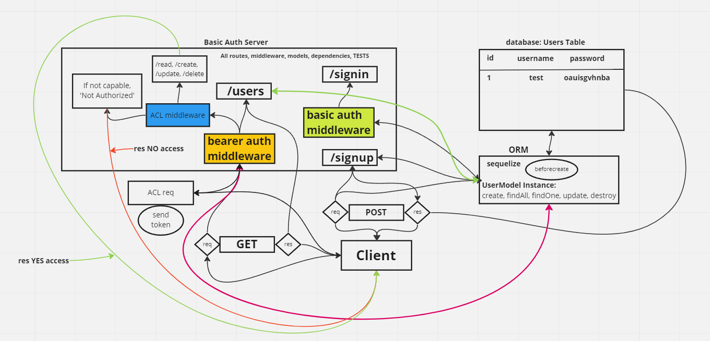

# LAB - Class 08

## Project: auth-api

### Author: Steve Gant

### Problem Domain  

In this final phase, the new requirement is to extend the restrictive capabilities of our routes to our API, implementing a fully functional, authenticated and authorized API Server using the latest coding techniques.

Specifically, we want to make the following restrictions:

  - Regular users can READ.
  - Writers can READ and CREATE.
  - Editors can READ, CREATE, and UPDATE.
  - Administrators can READ, CREATE, UPDATE, and DELETE.

Routes that end up performing those actions in our API/Database need to be protected by both a valid user and that user’s permissions.

### Links and Resources

- [GitHub Actions ci/cd](https://github.com/stevengant/auth-api/actions) 
- [back-end server url](https://stevegant-auth-api.onrender.com)

### Setup

#### `.env` requirements (where applicable)

PORT=3001
DATABASE_URL=postgres://localhost:5432/lab08
SECRET=mysecret

#### How to initialize/run your application (where applicable)

- e.g. `nodemon`

#### How to use your library (where applicable)

#### Features / Routes

- Feature One: Details of feature
- GET : `/user` - specific route to hit

#### Tests

- How do you run tests?
- Any tests of note?
- Describe any tests that you did not complete, skipped, etc

#### UML

